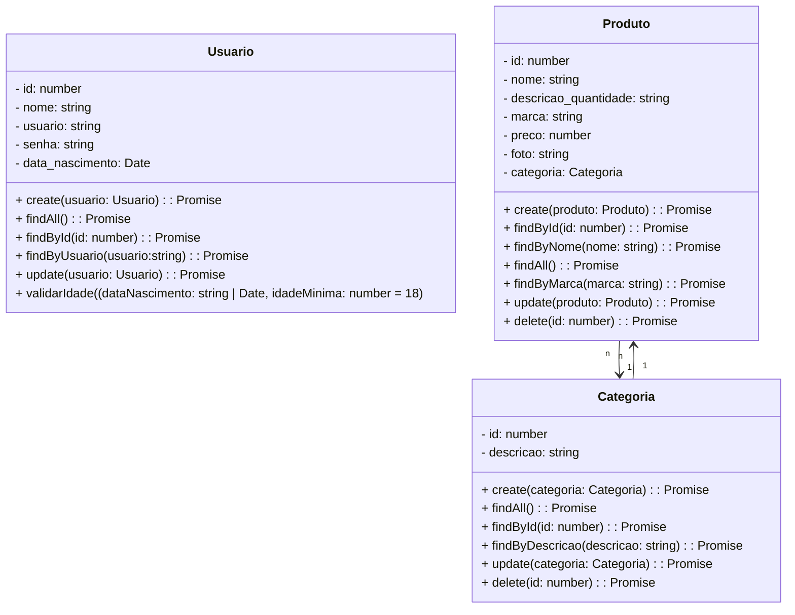

# Projeto Final Bloco 02 - Backend

<br />
<div align="center">
    
</div>
<br /><br />

## 1. Descrição

Este projeto consiste na criação de um sistema de comércio eletrônico para uma farmácia, utilizando o framework NestJS. O sistema foi desenvolvido com o objetivo de gerenciar produtos, categorias e usuários(administradores) de forma eficiente, implementando funcionalidades de CRUD (Create, Read, Update, Delete) e aplicando os conceitos fundamentais do NestJS, como organização modular, uso de serviços, controladores e conexão com banco de dados.

------


### 2. Principais Funcionalidades

1. Cadastro e gerenciamento de usuários.  

2. Cadastro e gerenciamento de categoria.  

3. Criação, consulta e gerenciamento de produtos.  

4. Relacionamentos eficientes entre entidades (categoria e produto).  

5. Banco de dados relacional com suporte a consultas complexas(por categoria, descrição, nome, marca e id).  

------

## 3. Diagrama de Classes



------

## 4. Diagrama Entidade-Relacionamento (DER)

Adicione a imagem do Diagrama:

<div align="center">
    
</div>

---

## 5. Tecnologias Utilizadas

| Item                          | Descrição  |
| ----------------------------- | ---------- |
| **Servidor**                  | Node.js    |
| **Linguagem de Programação**  | TypeScript |
| **Framework**                 | NestJS     |
| **ORM**                       | TypeORM    |
| **Banco de Dados Relacional** | MySQL      |

------

## 6. Configuração e Execução

1. Clone o repositório:  

   ```bash

   git clone https://github.com/seu-repositorio/boraaí-backend.git

2. Instale as dependências:

   ```bash

   npm install

   ```

3. Configure o banco de dados no arquivo `app.module.ts`.

4. Execute a aplicação:

   ```bash

   npm run start:dev


